# Aplikacja do Planowania Działań i Analizy Efektywności
Ta aplikacja została zaprojektowana do efektywnego zarządzania czasem, umożliwiając użytkownikom planowanie działań na różne okresy (dzień, tydzień, miesiąc) oraz monitorowanie postępów w realizacji zadań. Aplikacja pozwala użytkownikom na ustawianie celów, priorytetyzację zadań oraz generowanie statystyk, co ułatwia analizę efektywności działań.

## Spis Treści
- [Specyfikacja Projektu](#specyfikacja-projektu)
- [Projekt systemu](#projekt-systemu)
- [Kod API](#kod-api)
- [Działanie aplikacji](#działanie-aplikacji)

## Specyfikacja Projektu
### Opis Aplikacji
Aplikacja służy do efektywnego zarządzania czasem. Umożliwia użytkownikom planowanie działań na różne okresy (dzień, tydzień, miesiąc) oraz monitorowanie postępów w realizacji zadań. Pozwala na ustawianie celów, priorytetyzację zadań oraz generowanie statystyk w celu analizy efektywności działań.

### Zakres Funkcjonalności
Aplikacja oferuje następujące kluczowe funkcjonalności:
1. Ustawianie celów 
- Użytkownik może dodawać, usuwać i edytować cele.
- Użytkownik może przypisywać terminy realizacji do każdego celu.
- Użytkownik może ustalać priorytety dla celów (niski, średni, wysoki).
- Do celów można przypisywać zadania; zrealizowanie zadania w celu zwiększa całkowity postęp realizacji celu.
2. Planowanie działań 
- Użytkownik może planować działania na dzień, tydzień lub miesiąc.
- Możliwość przypisania celów do konkretnych dni oraz tworzenie szczegółowych celów.
- Użytkownik może przeglądać zaplanowane działania w kalendarzu lub w formie listy.
- Użytkownik może włączyć powiadomienia.
3. Monitorowanie realizacji 
- Użytkownik może zaznaczać zadania jako ukończone.
- Użytkownik może dodawać notatki do zadań dla lepszej organizacji.
4. Generowanie statystyk 
- Aplikacja generuje statystyki dotyczące zrealizowanych i niezrealizowanych zadań.
- Istnieje możliwość filtrowania statystyk według czasu, celów i priorytetów.

### Zastosowane Technologie
1. Frontend: 
- React 
- React Router 
- React Big Calendar 
- Sass 
2. Backend: 
- ASP.NET Core Web API 
- Entity Framework Core 
- Baza danych MySQL 

## Projekt Systemu
### Model Aplikacji 
1. UI (Interfejs Użytkownika) 
- Interfejs umożliwia tworzenie, edytowanie i usuwanie celów oraz zadań z nimi powiązanymi.
- Pozwala także na dodawanie notatek do zadań.
- Zawiera formularze do dodawania i edytowania celów, zadań i notatek.
- Posiada widok kalendarza
- Posiada widok statystyk.
2. Logika Aplikacji 
- User - klasa reprezentująca użytkownika.
- Goal - klasa reprezentująca cel.
- Task - klasa reprezentująca pojedyncze zadanie w celu.
- Statistics - klasa odpowiedzialna za generowanie statystyk.
- Notes - klasa reprezentująca notatki zadań.
3. Technologie 
- Frontend napisany w React.
- Backend napisany w ASP.NET Core Web API obsługuje logikę aplikacji.
- Baza danych MySQL.

### Model Danych 
Poniżej przedstawiono schemat relacyjny bazy danych:
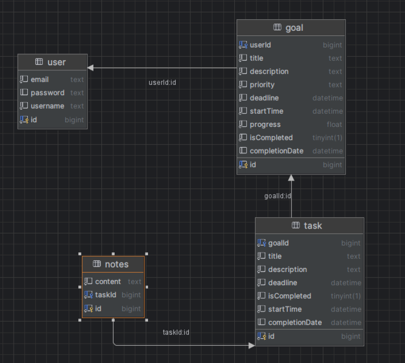

### Kod API
Cały kod API jest dostępny w moim repozytorium na GitHub: 
https://github.com/RaghRoog/planning-app-api.

## Działanie Aplikacji
### Rejestracja 
Użytkownik może zarejestrować się na portalu. Dane rejestracyjne są zapisywane w bazie danych i poddawane sprawdzeniu (jest to uproszczona rejestracja, m. in. bez hashowania haseł).
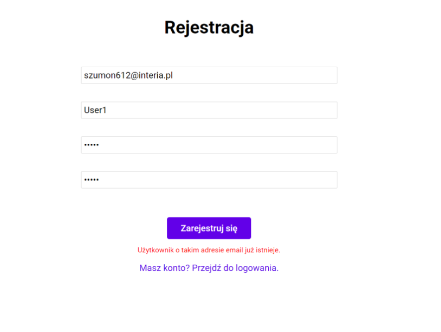
### Logowanie 
Zarejestrowany użytkownik loguje się do portalu na podstawie danych podanych przy rejestracji.
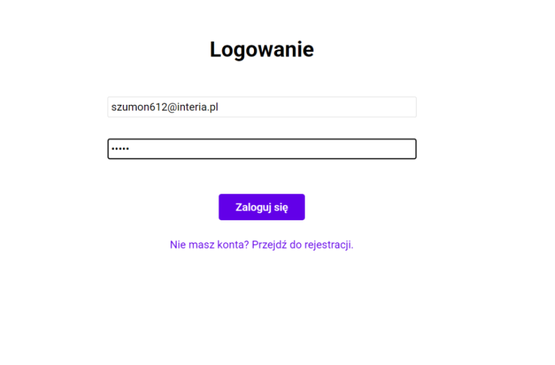
### Strona Główna 
Strona główna wyświetla najbliższe zadania i cele użytkownika (jeśli istnieją) oraz kalendarz.
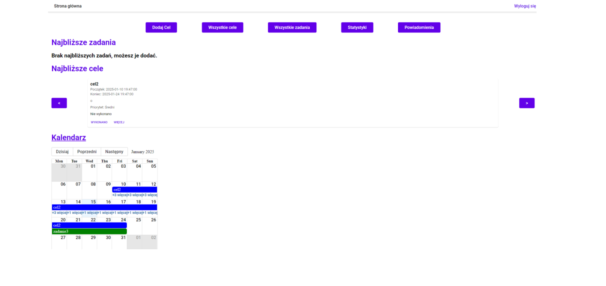
### Dodawanie i Edytowanie Celów 
Strona pozwala na dodawanie nowych celów oraz edycję istniejących.
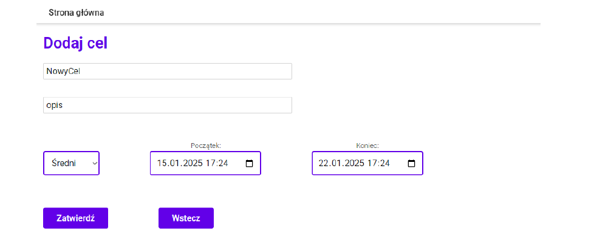
### Szczegóły Celu 
Strona wyświetla szczegóły celu i pozwala na zarządzanie nim. Jeśli cel posiada zadania, są one wyświetlane na stronie szczegółów celu.
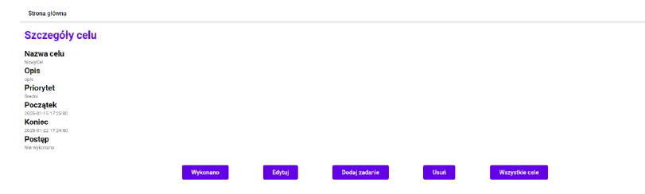
### Dodawanie i Edytowanie Zadań 
Strona pozwala na dodawanie nowych zadań dla celu lub edytowanie istniejącego zadania.
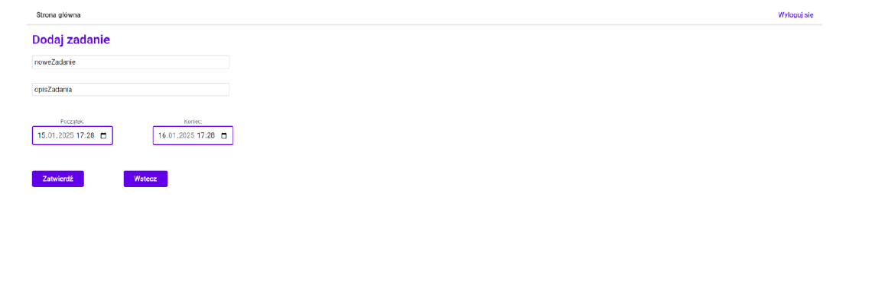
### Szczegóły Zadania 
Strona wyświetla szczegóły zadania i pozwala na zarządzanie nim. Jeśli zadanie posiada notatki, są one wyświetlane na stronie szczegółów zadania.
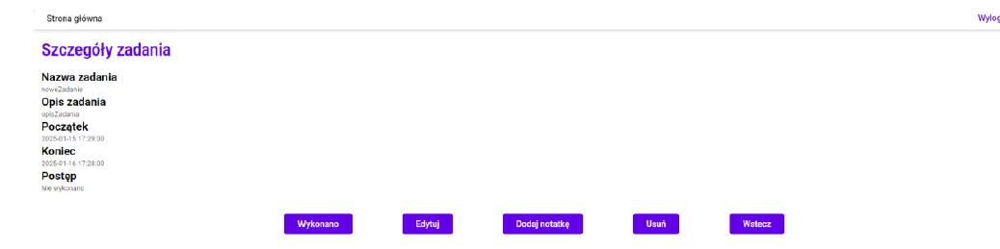
### Dodawanie i Edytowanie Notatek 
Strona pozwala na dodawanie notatek do zadania lub edycję istniejącej notatki.
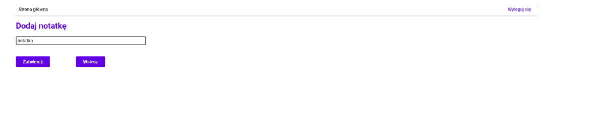
### Wszystkie Cele 
Strona pozwala wyświetlać wszystkie cele użytkownika oraz filtrować je na podstawie ich statusu.
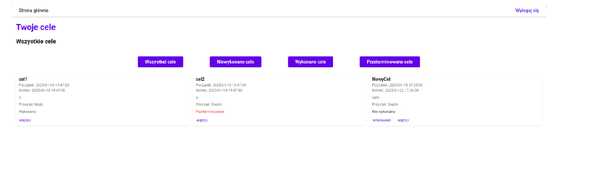
### Wszystkie Zadania 
Strona pozwala wyświetlać wszystkie zadania oraz filtrować je na podstawie statusu.
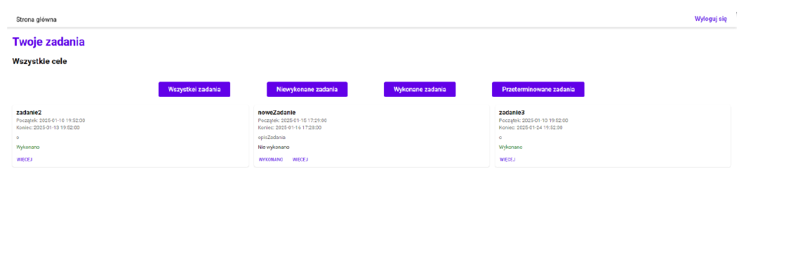
### Kalendarz 
Strona wyświetla dużą wersję kalendarza.
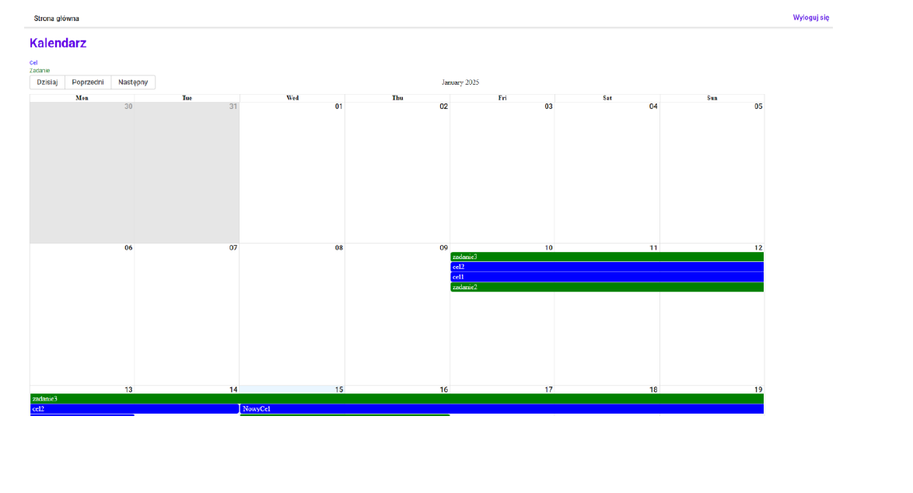
